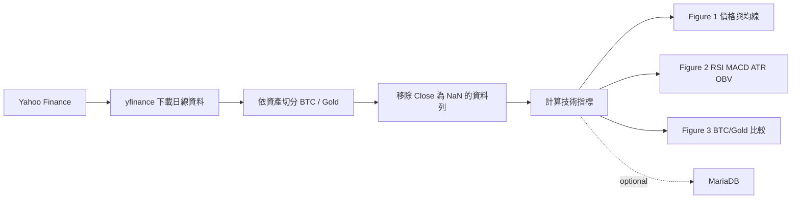
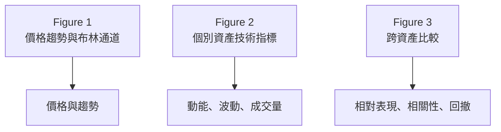

# 比特幣與黃金2026上半年趨勢分析比較

以 Python 建立的金融時間序列分析專案，擷取 2026 年上半年的 Bitcoin
（`BTC-USD`）與黃金期貨（`GC=F`）日線行情，從趨勢、動能、波動、成交量、
相對表現與風險等面向進行比較。

> 本專案用於教育與研究示範，不構成投資建議。技術指標是歷史資料的描述工具，
> 不能保證未來報酬。

## 目錄

- [專案概覽](#專案概覽)
- [分析流程](#分析流程)
- [指標與解讀](#指標與解讀)
- [圖表導覽](#圖表導覽)
- [快速開始](#快速開始)
- [MariaDB 資料儲存](#mariadb-資料儲存)
- [資料與限制](#資料與限制)
- [後續方向](#後續方向)

## 專案概覽

| 項目 | 說明 |
| --- | --- |
| 分析期間 | 2026-01-01 至 2026-06-30 |
| 資產 | Bitcoin（`BTC-USD`）、黃金期貨（`GC=F`） |
| 資料頻率 | 每日（`1d`） |
| 資料來源 | Yahoo Finance，透過 `yfinance` 取得 |
| 主要輸出 | Figure 1 價格趨勢、Figure 2 技術指標、Figure 3 跨資產比較 |
| 執行入口 | `btc_gold_parser.py` |
| 儲存選項 | MariaDB `btc_gold_db.btc_gold_data`，目前寫入呼叫預設停用 |

### 專案目的

1. 建立可重現的金融資料下載與清理流程。
2. 使用多種技術指標描述 BTC 與 Gold 的市場狀態。
3. 以相同期間、正規化價格與報酬相關性進行跨資產比較。
4. 將分析結果整理成適合報告與後續資料庫查詢的結構。

## 分析流程



Gold 期貨在週末與部分非交易日沒有價格，因此計算指標前會依 `Close` 移除
空值；BTC 具 24/7 行情，兩者的有效交易日數可能不同。

## 指標與解讀

### 個別資產指標

| 分析面向 | 指標 | 目前參數 | 可回答的問題 |
| --- | --- | --- | --- |
| 趨勢 | SMA | 20、50、200 日 | 價格位於短、中、長期均線上方或下方？ |
| 趨勢 | EMA | 20 日 | 近期價格趨勢是否正在加速或轉弱？ |
| 價格區間 | Bollinger Bands | 20 日、2 倍標準差 | 價格是否接近近期波動區間的上緣或下緣？ |
| 動能 | RSI | 14 日 | 是否接近常用的超買（70）或超賣（30）區域？ |
| 動能 | MACD | 12/26/9 | 快慢 EMA 的差異與趨勢動能是否轉折？ |
| 波動 | ATR | 14 日 | 每日真實價格波動幅度如何？ |
| 波動 | 年化波動率 | 30 日，乘以 `sqrt(252)` | 近期報酬波動是否擴大？ |
| 成交量 | OBV | 依收盤漲跌累積成交量 | 價格變化是否有成交量方向支持？ |
| 風險 | Drawdown | 相對歷史最高收盤價 | 從高點回落的幅度有多大？ |

### 跨資產比較指標

| 指標 | 計算方式 | 解讀 |
| --- | --- | --- |
| 正規化價格 | `Close / 期初 Close * 100` | 消除價格尺度差異，直接比較期初至期末表現。 |
| BTC/Gold 比率 | `BTC Close / Gold Close` | 比率上升代表 BTC 相對 Gold 走強。 |
| 30 日滾動相關係數 | BTC 與 Gold 日報酬的 rolling correlation | 觀察兩資產短期同向或反向程度。 |
| 回撤比較 | `Close / cummax(Close) - 1` | 比較兩種資產在期間內的抗跌程度。 |

## 圖表導覽

| Figure | 內容 | 版面 |
| --- | --- | --- |
| Figure 1 | 收盤價、Bollinger Bands、SMA20、SMA50、EMA20 | BTC 上、Gold 下，共用日期軸 |
| Figure 2 | RSI、MACD、30 日年化波動率、ATR、OBV | BTC 左、Gold 右，五列指標對照 |
| Figure 3 | 正規化價格、BTC/Gold 比率、30 日相關係數、回撤 | 2 x 2 跨資產比較 |



## 技術棧

| 技術 | 用途 |
| --- | --- |
| Python 3.12+ | 主要開發語言 |
| `yfinance` | 下載 Yahoo Finance 歷史行情 |
| `pandas` | 時間序列與資料表處理 |
| `ta` | 計算技術分析指標 |
| `matplotlib` | 建立多圖表分析面板 |
| `mariadb` | MariaDB Connector/Python，提供資料庫寫入能力 |
| `uv` | 虛擬環境與依賴管理 |

## 快速開始

### 環境需求

| 需求 | 建議版本 |
| --- | --- |
| Python | `>=3.12` |
| uv | 最新穩定版 |
| 網路 | 可連線至 Yahoo Finance |
| MariaDB | 只有啟用資料寫入時才需要 |

### 安裝與執行

```powershell
uv sync
uv run python btc_gold_parser.py
```

程式會下載資料、計算指標，並依序開啟價格分析、技術指標與跨資產比較圖表。
若使用沒有圖形介面的環境，可設定 `MPLBACKEND=Agg` 進行非互動式測試，但此時
不會顯示視窗。

## MariaDB 資料儲存

程式已包含 MariaDB 寫入函式，但目前主流程中的 `save_to_mariadb(market_data)`
呼叫被註解，避免未設定資料庫時阻塞圖表分析。啟用後會自動建立：

| 資料庫物件 | 名稱 |
| --- | --- |
| Database | `btc_gold_db` |
| Table | `btc_gold_data` |
| Primary key | `symbol`, `trade_date` |
| 寫入策略 | 重複主鍵時更新行情與 `sma20` |

設定連線環境變數：

```powershell
$env:MARIADB_HOST = "127.0.0.1"
$env:MARIADB_PORT = "3306"
$env:MARIADB_USER = "root"
$env:MARIADB_PASSWORD = "your-password"
```

目前資料表欄位：

| 欄位 | 型別 | 說明 |
| --- | --- | --- |
| `symbol` | `VARCHAR(10)` | `BTC-USD` 或 `GC=F` |
| `trade_date` | `DATE` | 行情日期 |
| `open_price` 至 `adj_close` | `DOUBLE` | OHLC 與調整後收盤價 |
| `volume` | `BIGINT` | 成交量 |
| `sma20` | `DOUBLE` | 20 日簡單移動平均線 |

## 資料與限制

| 項目 | 說明 |
| --- | --- |
| 資料依賴 | Yahoo Finance 回傳內容、可用性與欄位定義可能變更。 |
| 交易日差異 | BTC 全天交易；Gold 期貨只在特定交易時段與日期有資料。 |
| 指標暖機期 | SMA200、30 日波動率等指標需要足夠歷史資料，前段可能是 `NaN`。 |
| 成交量解讀 | Gold 的成交量是期貨資料，不宜與 BTC 交易量直接等量比較。 |
| 分析範圍 | 目前未納入 DXY、10 年期美債殖利率、CPI 或 BTC 鏈上指標。 |
| 投資用途 | 圖表只描述歷史行為，不代表交易訊號或報酬保證。 |

## 後續方向

| 優先級 | 延伸項目 | 預期價值 |
| --- | --- | --- |
| 高 | 將資料下載、指標計算、繪圖拆成獨立模組 | 提升可測試性與維護性 |
| 高 | 加入 DXY、US10Y、S&P 500 | 分析宏觀環境與 risk-on/risk-off 關係 |
| 中 | 將所有指標欄位寫入 MariaDB | 支援 SQL 查詢與歷史報表 |
| 中 | 匯出 PNG、CSV 或 HTML 報告 | 方便分享與成果保存 |
| 低 | 加入 MVRV、SOPR 等 BTC 鏈上資料 | 補充 Bitcoin 特有的基本面分析 |

## 參考資料

- [yfinance](https://github.com/ranaroussi/yfinance)
- [ta](https://github.com/bukosabino/ta)
- [pandas](https://github.com/pandas-dev/pandas)
- [Matplotlib](https://github.com/matplotlib/matplotlib)
- [MariaDB Connector/Python](https://github.com/mariadb-corporation/mariadb-connector-python)
